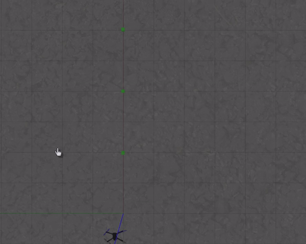
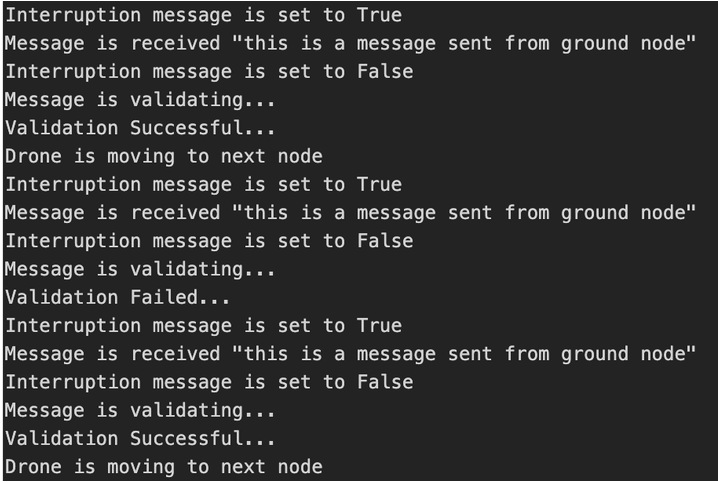

# px4_simulation
## Gazebo simulation for NRF communication between drones and ground nodes.

### Introduction

In this project I have simulated communication between drone and ground nodes in an abstract way using publish subscriber messaging protocol. And also make decission to continue it's mission to next node or stay in the same node for retransmission if the transfered data is not in the acceptable level.

#### Drone Mission

This is a gazebo simulation how drone flies to each nodes to collect data. This is implemented as a ROS node.

#### Drone Communication

This is the terminal output of how communiction is initiated and terminated in each node.

Note: Here Drone Mission is implemented as a ROS Node and communication simulation is implemented within the PX4 stack. To make the project even fancier I was trying to establish communication between MAVROS and PX4 which I am still woriking on.

### Setup and Run the project

#### Environment

- Gazebo(recomended Gazebo9 or later)
- ROS Melodic
- MAVROS Library
- Cloned PX4 Firmware

#### Drone Mission

Copy the drone simulation folder into src of your catkin workspace and launch it.

#### Drone Communication

Copy the files inside sitl_gazebo folder and paste it in the cloned PX4 firmware and run it.
